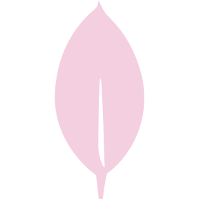

 

   
  
 
 
  
  

  

<h5>Hi 👋, I'm Erica Dayton</h5>
<h5>I'm a Fullstack Developer based in Los Angeles, CA. I love creating.</h5>

- 👨‍💻 Some of my projects are available at [beeperdev.com](beeperdev.com)

- 📫 How to reach me **beeperdev.erica@gmail.com**

 

<h2 align='center'> Technologies</h2>
<table>
  <tbody>
    <td valign='top' width='33.33%'>
      <h3 align='center'>Frontend<h3>
        

          
          
          
          
          
        
                                 
    </td>
    <td valign='top' width='33.33%'>
      <h3 align='center'>Backend<h3>
        

          
          
          
          
          
          
        
                                 
    </td>
    <td valign='top' width='33.33%'>
      <h3 align='center'>Other Tech<h3>
        

          
                    
        
                                 
    </td>
  </tbody>
</table>

      
      
<h2 align="center">Projects</h2>
<table>
  <tr>
    <td width="50%" valign="top">
      <h3 align="center">Portfolio</h3>
       
      
       
      

        
        
      

      
<strong>Javascript, Bootstrap, Sass, Node.js, & Express.js</strong> - Platform to help build momentous milestones along with your friends and family! Travelara makes Dream Trips a Reality!

    </td> 
    <td width="50%" valign="top">
      <h3 align="center">TinDog App Landing Page</h3>
       
      
       
      

        
        
      

      
<strong>Javascript & Phaser.js</strong> - The awaited sequel sees our Rigley friend jumping through firewalls "Flappy Bird" style.

    </td>
  </tr> 
</table>

